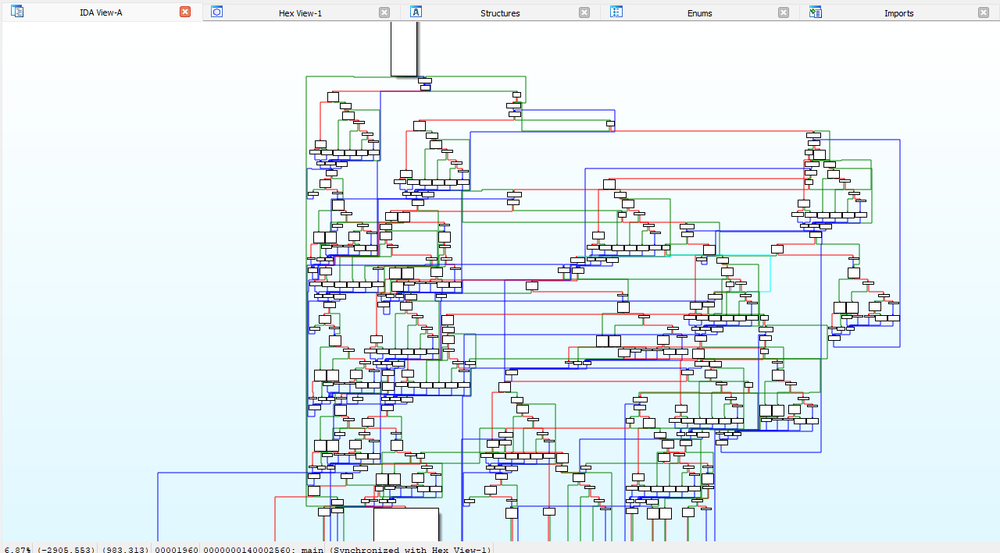

Cutypie-Obfuscator is a C++ header-only library for string obfuscation and control flow for a static analysis disassembler tools like ida, binaryninja, ghidra and more. 
This library helps protect your code against reverse engineering by implementing compile-time string encryption and compile-time control flow obfuscation.


## ✨ Features
- **String Encryption**: Compile-time string obfuscation
- **Control Flow Obfuscation**: Complex flow patterns in disassemblers
- **Header-Only**: Easy integration with no dependencies


## ✨ The Result:
<div align="center">
    
</div>

## 🚀 Quick Start
```cpp
#include "cutypie_obfuscator.h"

int main() {
    // Initialize control flow obfuscation
    Initialize();

    // Encrypt strings at compile-time
    constexpr auto encrypted = C_OBF("Hello, World!");
    // Decrypt strings at run-time
    const auto decrypted = encrypted.decrypt();
    
    return 0;
}
```
## 📋 Requirements
- C++17 or higher
- GCC, G++ or MSVC compiler (recommended)

## ⚙️ Configuration
Set your custom secret key in the header file:
```cpp
// Must be exactly 15 characters
constexpr char Secret_Key[] = "MySecretKey1234";
```
Set the Initialize Macro in the start of your int main() to enable control flow obfuscation
```cpp
int main() {
    // Initialize control flow obfuscation
    Initialize();
```

Use encryption string if you want to:
```cpp
constexpr auto encrypted = C_OBF("Hello, World!");
```
For Decryption (This process decrypt the string at runtime only):
```cpp
const auto decrypted = encrypted.decrypt();
```
